# [brain-adventure](https://marijavelickovska.github.io/brain-adventure)

This is a fun and educational quiz game designed for users who want to test their knowledge in Geography, History, or Mathematics. Users can choose a topic of interest, and each quiz consists of 15 carefully selected questions related to that subject.

At the end of the quiz, the user's score is displayed, showing how many answers were correct out of 15. Additionally, a detailed results table is generated, showing all questions, the user's answers, and the correct answers. This feature helps users identify their mistakes and learn from them.

The quiz is simple, interactive, and ideal for learners of all ages who want to challenge themselves or just have some fun while learning something new.

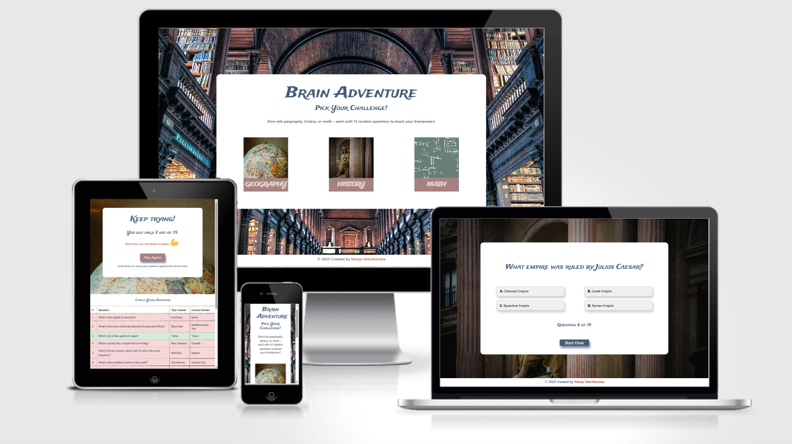

source: [brain-adventure amiresponsive](https://amiresponsive.blogspot.com/?url=https%3A%2F%2Fmarijavelickovska.github.io%2Fbrain-adventure%2F)

## UX

### The 5 Planes of UX

#### 1. Strategy Plane
##### Purpose
- To provide an interactive and educational quiz experience suitable for users of all ages.
- To help users refresh and expand their knowledge in geography, history, and mathematics.
- To offer a lightweight, responsive quiz app that works well across all modern devices.

##### Primary User Needs
- To access a fun and educational quiz platform that works well on any device.
- To test and improve general knowledge in an engaging and non-intimidating way.
- To receive a clear score and a summary of all questions with correct answers, helping users learn from their mistakes.

##### Business Goals
- To create a lightweight, accessible web app that can be used in both educational and casual contexts.
- To build a reusable and expandable foundation for future quiz topics or features.

#### 2. Scope Plane
##### Features
- A full list of [Features](#features) can be viewed in detail below.

##### Content Requirements
- Includes a variety of questions across three main subject areas: geography, history, and math.
- Each session presents randomized questions.
- Provides feedback at the end of the quiz, including the total score, the list of all questions, the user's answers, and the correct answers to help them learn from their mistakes.
- Allows users to retake the quiz as many times as they like.

#### 3. Structure Plane
##### User Flow
- Linear user flow: Introduction → Select quiz topic → Quiz questions → Score and feedback screen.
- Users navigate by clicking on image buttons, selecting answers, and using buttons like "Start Over" and "Play Again".
- Simple and consistent interaction patterns for ease of use.

#### 4. Skeleton Plane
##### Wireframe Suggestions
- A full list of [Wireframes](#wireframes) can be viewed in detail below.

#### 5. Surface Plane
##### Visual Design Elements
- **[Colours](#colour-scheme)**: see below.
- **[Typography](#typography)**: see below.

### Colour Scheme

I used [coolors.co](https://coolors.co/080708-3772ff-df2935-fdca40-e6e8e6) to generate my color palette.

- `#a68182` light brown color
- `#aa4933` dark orange color
- `#7c90ab` light blue color
- `#435b76` light brown color
- `#f9bc66` gold color

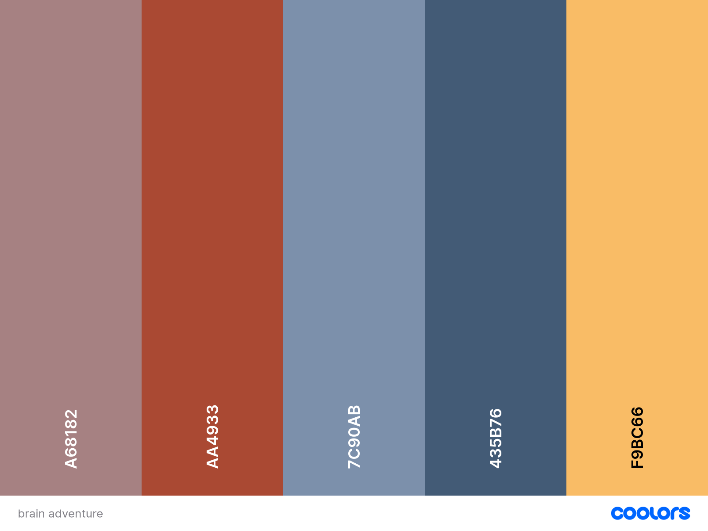

### Typography
- [Trade Winds](https://fonts.google.com/specimen/Trade+Winds) was used for the primary headers and titles.
- [Roboto](https://fonts.google.com/specimen/Roboto) was used for other secondary text.
- [Emoji](https://emojipedia.org/) emoji were used throughout the site.

## User Stories

| Target | Expectation | Outcome |
| --- | --- | --- |
| As a user | I want to easily start the quiz | so I can begin answering questions right away |
| As a user | I want each question to appear one at a time | so I don’t get overwhelmed |
| As a user | I want to choose one correct answer from multiple options | so I don't have to type |
| As a user | I don't want the quiz to show me if my answer is correct during the quiz | so I stay curious and focused |
| As a user | I want to see which answers I got wrong and the correct ones at the end | so I can learn from my mistakes |
| As a user | I want to get a final score and a short message at the end | so I know how well I did |
| As a user | I want the quiz to have a good design with a background image | so that it matches the quiz theme and keeps me visually engaged |

## Wireframes

| Page | Mobile | Tablet | Desktop |
| --- | --- | --- | --- |
| Home | 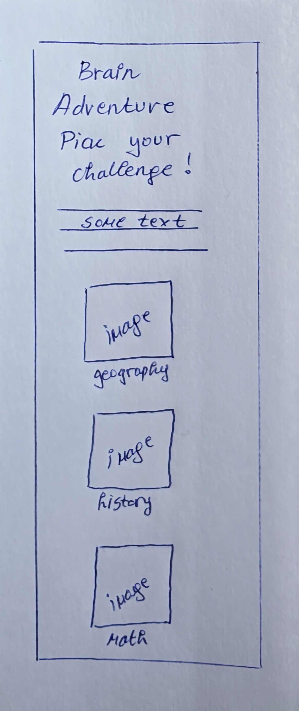 | 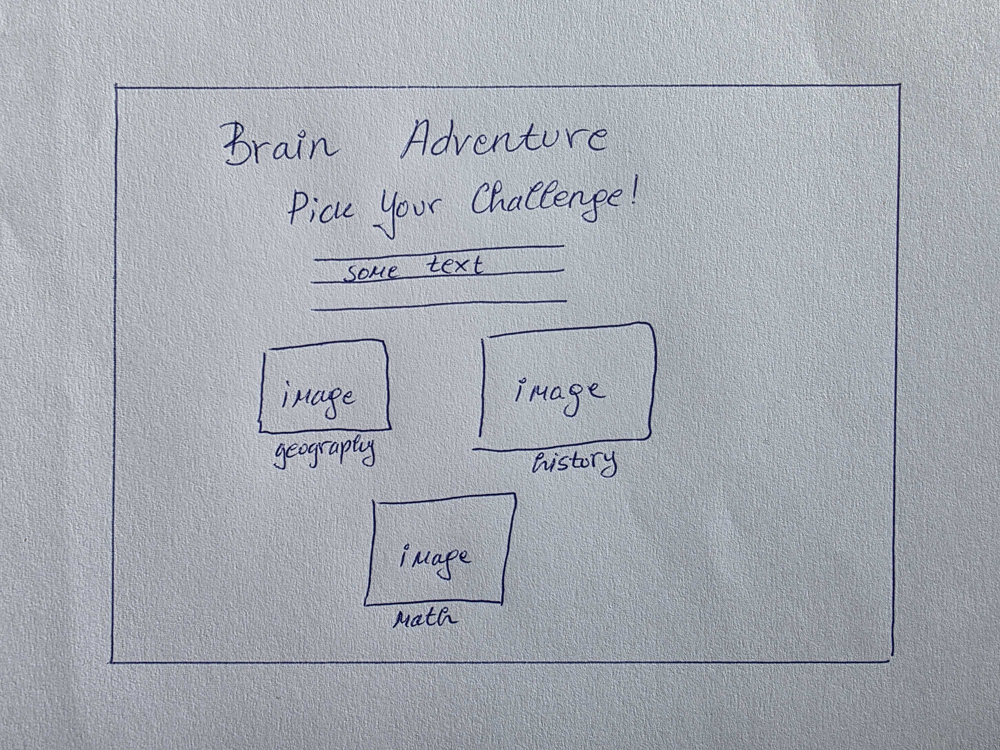 | 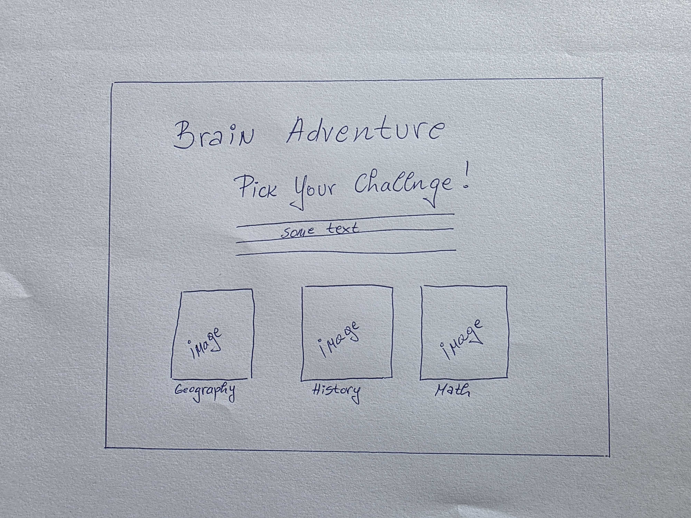 |
| Quiz | 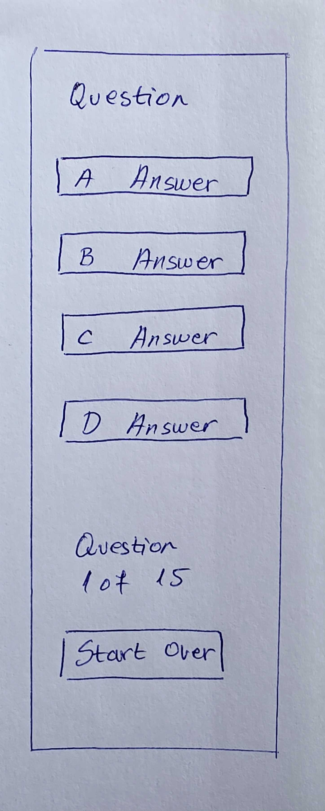 | 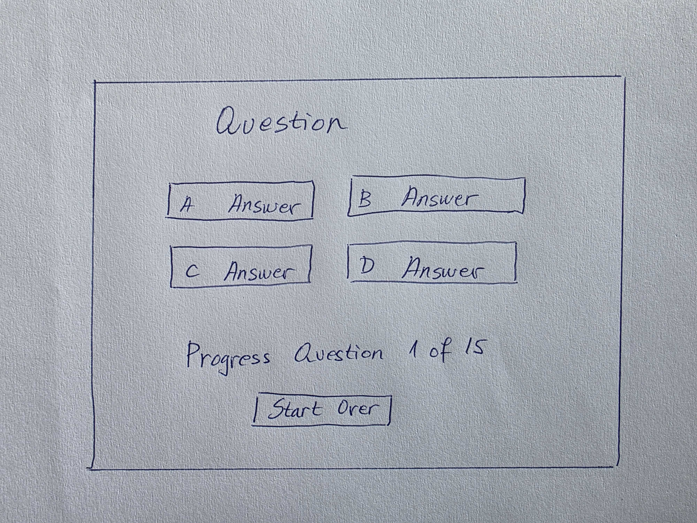 | 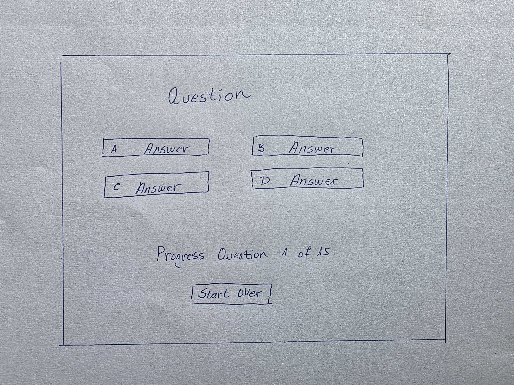 |
| Results |  |  | 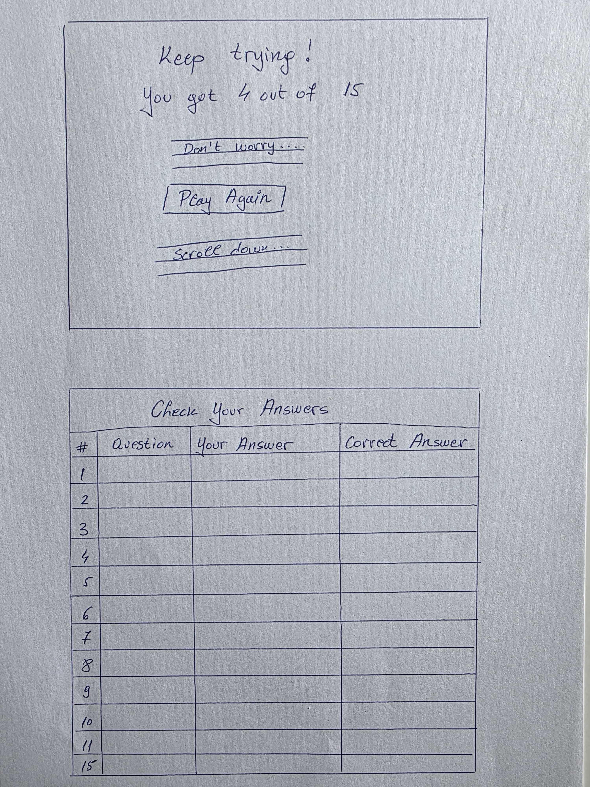 |
| 404 | 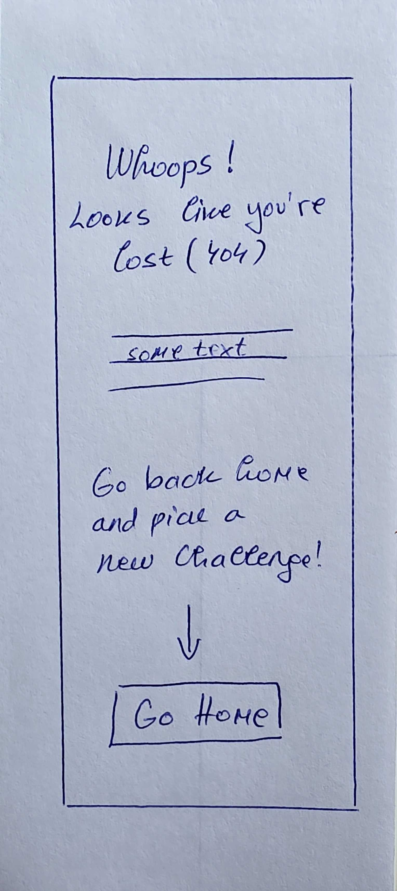 | 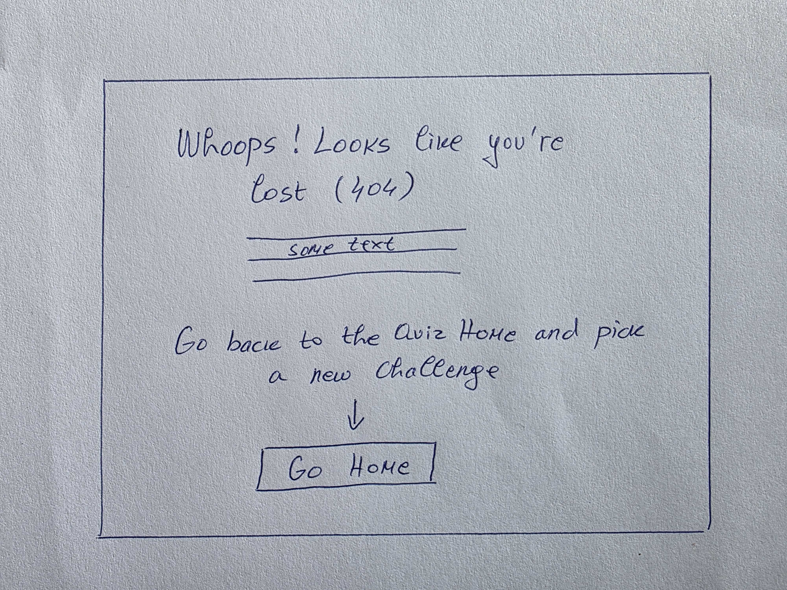 | 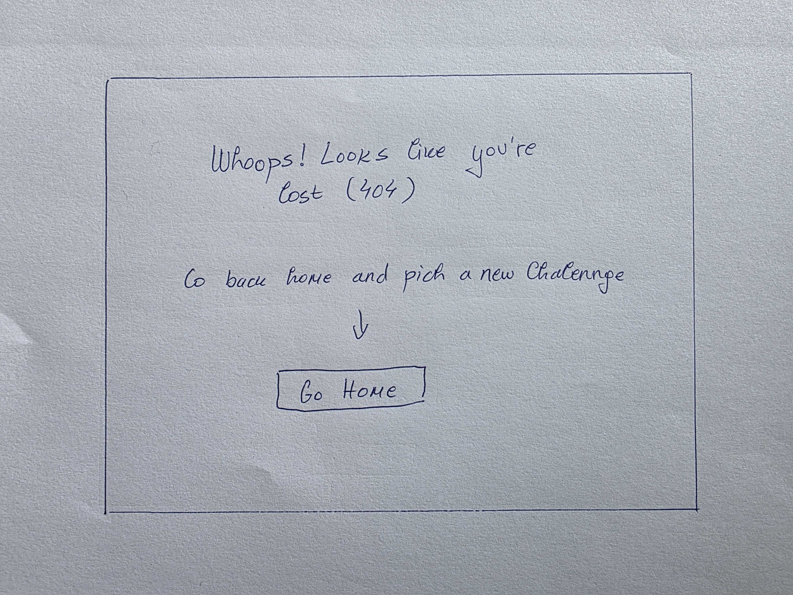 |

## Features

### Existing Features

| Feature | Notes | Screenshot |
| --- | --- | --- |
| Topics | The home page features three clickable images that represent the available quiz topics: Geography, History, and Mathematics. Users can select a quiz topic by clicking on one of the images, which will direct them to the corresponding set of questions. This interactive design helps users easily choose the subject they want to be quizzed on.|  |
| Confirmation modal | When a user clicks on one of the topic images, a confirmation modal appears. It informs the user which topic they have selected and asks for confirmation before starting the quiz. This helps prevent accidental selections and ensures that the user is ready to begin. | 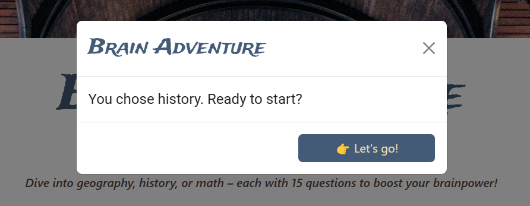 |
| Question | Each of the 15 questions in the quiz is randomly selected from a pool of 30 questions related to the chosen topic, ensuring that every quiz session feels unique and provides a varied learning experience for the user. |  |
| Answers | For each question, four possible answers are provided. Before displaying them, the answers are randomly shuffled to ensure that their order is different every time. This prevents users from relying on answer position and encourages thoughtful selection.|  |
| Quiz progress| During the quiz, users can see their current progress - specifically which question they are on out of the total number of questions. This helps them stay oriented and manage their time and focus more effectively throughout the quiz. |  |
| Start Over button | Inside the quiz container, users have access to a Start Over button at any time during the quiz. This allows them to restart the quiz from the beginning if they are not satisfied with their current progress, offering flexibility and control over their experience. |  |
| Score | At the end of the quiz, the user's score is displayed — showing how many questions they answered correctly out of the total number. Additionally, a feedback message is shown based on the user’s score, offering encouragement or suggesting improvement depending on their performance. | 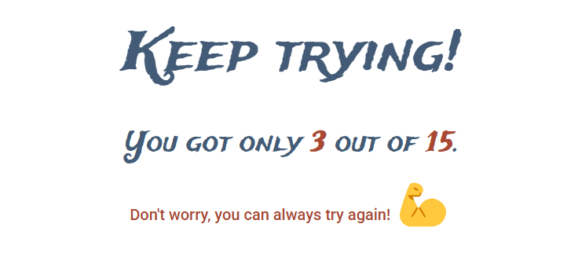 |
| Results table | A results table is displayed at the end of the quiz, showing all the questions, the user's answers, and the correct answers. This allows the user to review which questions they answered incorrectly and learn from their mistakes. Incorrect answers are highlighted in red, while correct answers are highlighted in green for better visual clarity and a more engaging learning experience. | 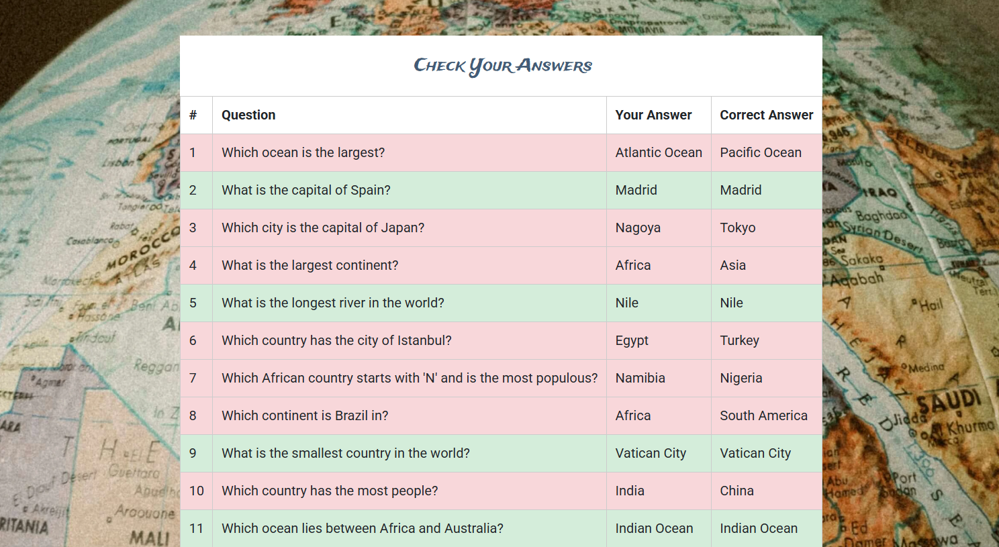 |
| 404 | If the user navigates to an incorrect URL, a 404 error page is displayed, informing them that they have taken a wrong path. Along with the error message, a Go Home button is provided, which allows the user to directly return to the homepage. If the user does not click the button within 10 seconds, the page automatically redirects them to the homepage. | 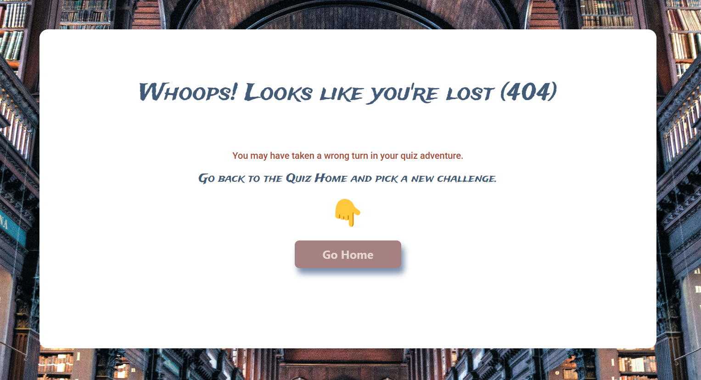 |

### Future Features

- **Timer for Each Question**: Add a timer for each question to enhance the challenge and urgency. Users will have a limited time to answer each question, encouraging quicker decision-making and making the quiz more engaging.
- **Additional Quiz Topics**: Expand the range of available quiz topics to include more subjects like Science, Literature, Art, and more. This will provide users with a broader selection of themes and cater to different interests.
- **Multiple Difficulty Levels**: Add different difficulty levels (easy, medium, hard) for the questions. Users can choose their preferred difficulty, which will make the quiz adaptable to different skill levels.
- **Hints and Explanations**: Implement a hint system for difficult questions. Users could request a hint, which would provide a brief explanation or clue to help them answer correctly.
- **Leaderboard**: Introduce a leaderboard where users can see their ranking compared to others. This will encourage competition and motivate users to improve their performance over time.
- **User Profiles**: Allow users to create profiles where they can track their quiz history, scores, and progress. This would provide a more personalized experience and a way to monitor improvement.

## Tools & Technologies

| Tool / Tech | Use |
| --- | --- |
|  | Generate README and TESTING templates. |
|  | Version control. (`git add`, `git commit`, `git push`) |
|  | Secure online code storage. |
|  | Local IDE for development. |
|  | Main site content and layout. |
|  | Design and layout. |
|  | User interaction on the site. |
|  | Hosting the deployed front-end site. |
|  | Help debug, troubleshoot, and explain things. |

## Agile Development Process

### GitHub Projects

[GitHub Projects](https://www.github.com/marijavelickovska/brain-adventure/projects) served as an Agile tool for this project. Through it, EPICs, User Stories, issues/bugs, and Milestone tasks were planned, then subsequently tracked on a regular basis using the Kanban project board.

### GitHub Issues

| Link | Screenshot |
| --- | --- |
|  |  |
|  | 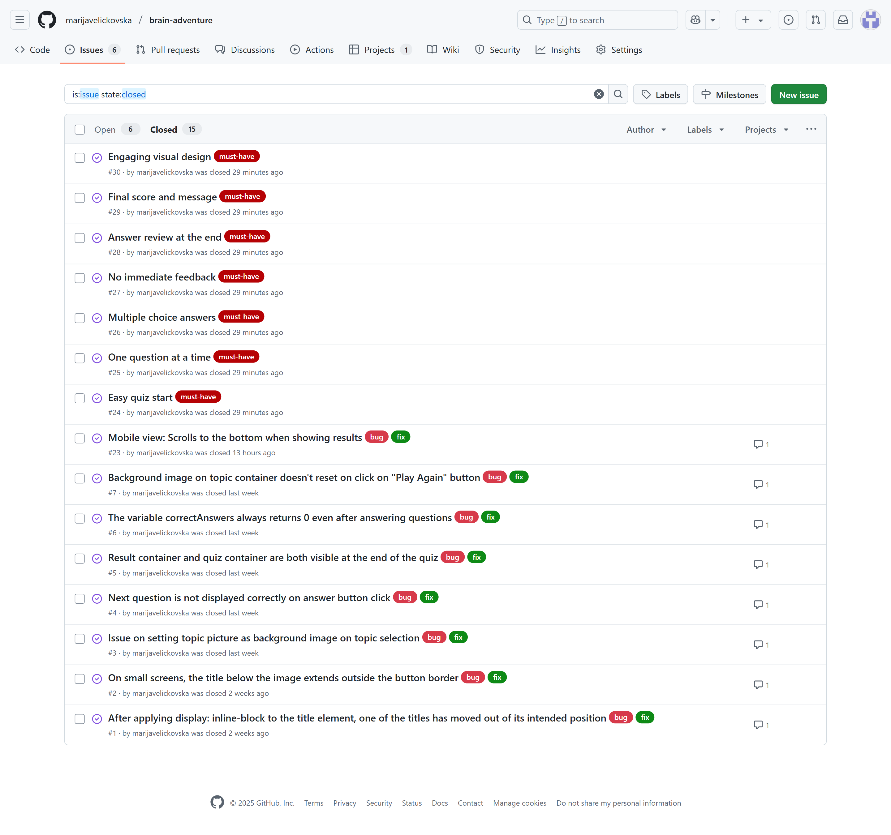 |

### MoSCoW Prioritization

I've decomposed my Epics into User Stories for prioritizing and implementing them. Using this approach, I was able to apply "MoSCoW" prioritization and labels to my User Stories within the Issues tab.

- **Must Have**: guaranteed to be delivered - required to Pass the project (*max ~60% of stories*)
- **Should Have**: adds significant value, but not vital (*~20% of stories*)
- **Could Have**: has small impact if left out (*the rest ~20% of stories*)
- **Won't Have**: not a priority for this iteration - future features

## Testing
> [!NOTE]
> For all testing, please refer to the [TESTING.md](TESTING.md) file.

## Deployment

### GitHub Pages

The site was deployed to GitHub Pages. The steps to deploy are as follows:

- In the [GitHub repository](https://www.github.com/marijavelickovska/brain-adventure), navigate to the "Settings" tab.
- In Settings, click on the "Pages" link from the menu on the left.
- From the "Build and deployment" section, click the drop-down called "Branch", and select the **main** branch, then click "Save".
- The page will be automatically refreshed with a detailed message display to indicate the successful deployment.
- Allow up to 5 minutes for the site to fully deploy.

The live link can be found on [GitHub Pages](https://marijavelickovska.github.io/brain-adventure).

### Local Development

This project can be cloned or forked in order to make a local copy on your own system.

#### Cloning

You can clone the repository by following these steps:

1. Go to the [GitHub repository](https://www.github.com/marijavelickovska/brain-adventure).
2. Locate and click on the green "Code" button at the very top, above the commits and files.
3. Select whether you prefer to clone using "HTTPS", "SSH", or "GitHub CLI", and click the "copy" button to copy the URL to your clipboard.
4. Open "Git Bash" or "Terminal".
5. Change the current working directory to the location where you want the cloned directory.
6. In your IDE Terminal, type the following command to clone the repository:
	- `git clone https://www.github.com/marijavelickovska/brain-adventure.git`
7. Press "Enter" to create your local clone.

Alternatively, if using Gitpod, you can click below to create your own workspace using this repository.

**Please Note**: in order to directly open the project in Gitpod, you should have the browser extension installed. A tutorial on how to do that can be found [here](https://www.gitpod.io/docs/configure/user-settings/browser-extension).

#### Forking

By forking the GitHub Repository, you make a copy of the original repository on our GitHub account to view and/or make changes without affecting the original owner's repository. You can fork this repository by using the following steps:

1. Log in to GitHub and locate the [GitHub Repository](https://www.github.com/marijavelickovska/brain-adventure).
2. At the top of the Repository, just below the "Settings" button on the menu, locate and click the "Fork" Button.
3. Once clicked, you should now have a copy of the original repository in your own GitHub account!

### Local VS Deployment

There are no remaining major differences between the local version when compared to the deployed version online.

## Credits

### Content

| Source | Notes |
| --- | --- |
| [Markdown Builder](https://markdown.2bn.dev) | Help generating Markdown files |
| [Chris Beams](https://chris.beams.io/posts/git-commit) | "How to Write a Git Commit Message" |
| [ChatGPT](https://chatgpt.com) | Help debug, explanations and translations. |
| [W3Schools](https://www.w3schools.com/) | Help with understanding some code and I take the meta tag for automatic redirection |

### Media

| Source | Notes |
| --- | --- |
| [favicon.io](https://favicon.io) | Generating the favicon |
| [Emojipedia](https://emojipedia.org/) | Emojis used on the site |
| [Flickr](https://live.staticflickr.com/1728/41072890110_7bc77e6062_h.jpg) | Library image |
| [Unsplash](https://unsplash.com/photos/blue-and-brown-desk-globe-7Z-Uayu13ps) | Geography image |
| [Pexels](https://images.pexels.com/photos/31541849/pexels-photo-31541849/free-photo-of-elegant-stone-sculpture-on-classical-column.jpeg) | History image |
| [Pembrokeshire](https://online.pembrokeshire.ac.uk/wp-content/uploads/sites/7/2018/07/Maths-IAL.jpg) | Math image |
| [TinyPNG](https://tinypng.com) | Compressing images < 5MB |
| [CompressPNG](https://compresspng.com) | Compressing images > 5MB |
| [PicFlow](https://picflow.com/convert/jpg-to-webp) | Converting images to `.webp` |
| [AmIresponsive](https://amiresponsive.blogspot.com/) | Screenshot used at the top of this document |

### Acknowledgements

- I would like to thank my Code Institute mentor, [Tim Nelson](https://www.github.com/TravelTimN) for the support throughout the development of this project.
- I would like to thank the [Code Institute Slack community](https://code-institute-room.slack.com) for the moral support; it kept me going during periods of self doubt.
- I would like to thank my partner, for believing in me, and allowing me to make this transition into software development.

