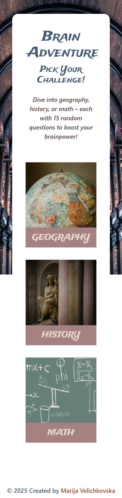
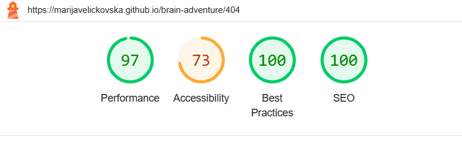
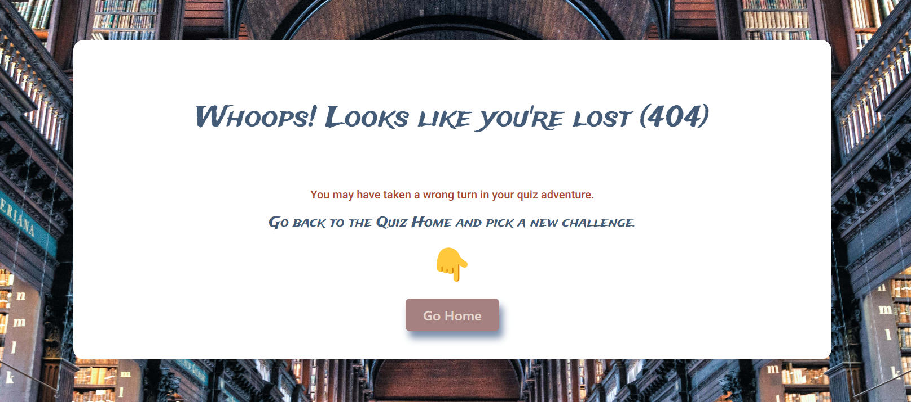
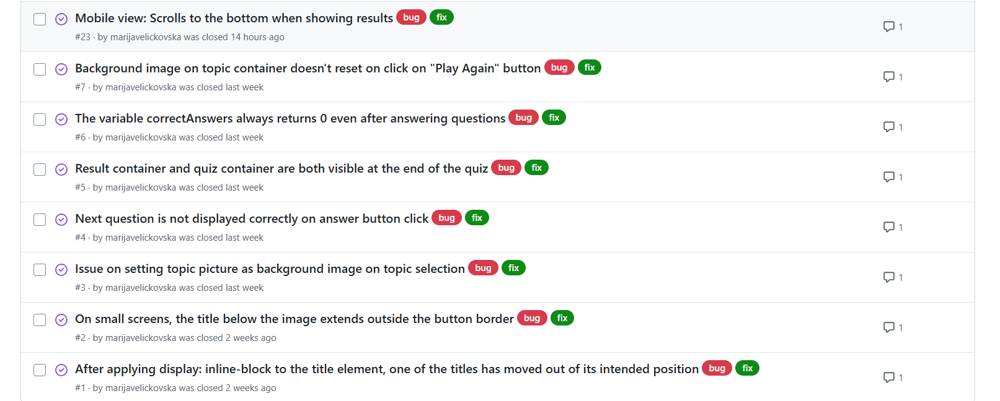

# Testing
> [!NOTE]
> Return back to the [README.md](README.md) file.

## Code Validation

### HTML

I have used the recommended [HTML W3C Validator](https://validator.w3.org) to validate all of my HTML files.

| Directory | File | URL | Screenshot | Notes |
| --- | --- | --- | --- | --- |
|  | [index.html](https://github.com/marijavelickovska/brain-adventure/blob/main/index.html) | [HTML Validator](https://validator.w3.org/nu/?doc=https://marijavelickovska.github.io/brain-adventure/index.html) |  | The warning occurred because the heading was initially empty, but it is dynamically filled with content using JavaScript. |
|  | [404.html](https://github.com/marijavelickovska/brain-adventure/blob/main/404.html) | [HTML Validator](https://validator.w3.org/nu/?doc=https://marijavelickovska.github.io/brain-adventure/404.html) |  | |

### CSS

I have used the recommended [CSS Jigsaw Validator](https://jigsaw.w3.org/css-validator) to validate all of my CSS files.

| Directory | File | URL | Screenshot | Notes |
| --- | --- | --- | --- | --- |
| assets | [style.css](https://github.com/marijavelickovska/brain-adventure/blob/main/assets/css/style.css) | [CSS Validator](https://jigsaw.w3.org/css-validator/validator?uri=https://marijavelickovska.github.io/brain-adventure) |  |  |

### JavaScript

I have used the recommended [JShint Validator](https://jshint.com) to validate all of my JS files.

| Directory | File | URL | Screenshot | Notes |
| --- | --- | --- | --- | --- |
| assets | [script.js](https://github.com/marijavelickovska/brain-adventure/blob/main/assets/js/script.js) | N/A |  | The warnings are due to unrecognized variables. This happens because `script.js` imports variables from another file, `dataTopic.js`, which might not be properly linked or loaded during testing. These warnings do not affect the actual functionality when all files are correctly imported in the final environment. |
| assets | [dataTopic.js](https://github.com/marijavelickovska/brain-adventure/blob/main/assets/js/dataTopic.js) | N/A |  | The warnings are for unused variables. These variables are actually used in `script.js` file. |

## Responsiveness

I've tested my deployed project to check for responsiveness issues.

| Page | Mobile | Tablet | Desktop | Notes |
| --- | --- | --- | --- | --- |
| Home |  |  |  | The DevTools full-page screenshot doesn't accurately reflect the actual responsiveness of the page. The layout has been tested across multiple devices and browsers and is responsive. However, the screenshots don’t properly reflect this, as they don’t capture the layout accurately. |
| Game |  |  |  | Works as expected |
| Results |  |  |  | The DevTools full-page screenshot doesn't accurately reflect the actual responsiveness of the page. The layout has been tested across multiple devices and browsers and is responsive. However, the screenshots don’t properly reflect this, as they don’t capture the layout accurately. |
| 404 |  |  |  | The DevTools full-page screenshot doesn't accurately reflect the actual responsiveness of the page. The layout has been tested across multiple devices and browsers and is responsive. However, the screenshots don’t properly reflect this, as they don’t capture the layout accurately. |

## Browser Compatibility

I've tested my deployed project on multiple browsers to check for compatibility issues.

| Page | Chrome | Firefox | Edge | Notes |
| --- | --- | --- | --- | --- |
| Home |  |  |  | Works as expected |
| Game |  |  |  | Works as expected |
| Results |  |  |  | The page has been tested on three browsers and displays and functions as expected. However, the screenshots don’t properly reflect this, as they don’t capture the layout accurately |
| 404 |  |  |  | Works as expected |

## Lighthouse Audit

I've tested my deployed project using the Lighthouse Audit tool to check for any major issues. Some warnings are outside of my control, and mobile results tend to be lower than desktop.

| Page | Mobile | Desktop |
| --- | --- | --- |
| Home |  |  |
| 404 |  |  |

## Defensive Programming

Defensive programming was manually tested with the below user acceptance testing:

| Page/Feature | Expectation | Test | Result | Screenshot |
| --- | --- | --- | --- | --- |
| Home | Feature should display three clickable images | Render the component and verify that three image elements are present and each has a clickable action. | On click, a modal was open as expected. |  |
| Modal | When an image is clicked, a modal should appear showing the selected topic and a confirmation button to start the quiz. | Click on any of the three images and verify that a modal appears. The modal displays the selected topic and include a confirmation button labeled "Let's go". On button click,  the quiz starts. | The modal opens correctly with the selected topic and a visible confirmation to start the quiz. Works as expected. |  |
| Question | Feature is expected to always display a random question from the selected topic. | Start the quiz multiple times with the same topic and verify that the question changes each time, ensuring randomness within the topic scope. | A different question is displayed on each quiz start, all related to the selected topic. |  |
| Answers | Feature is expected to always display four answers, randomly shuffled so that their positions change each time. | Start the quiz multiple times with the same question and verify that the four answers are present and appear in a different order each time. | All four answers are displayed and their order is randomized on each quiz attempt. Works as expected. |  |
| Progress | Feature is expected to show the user’s current question number out of a total of 15 questions. | Start the quiz and verify that the progress indicator updates correctly with each answered question (e.g., “Question 3 of 15”). | The progress is displayed correctly and updates with each question, accurately reflecting the current position out of 15. |  |
| Start-over-button | Feature is expected to return the user to the beginning of the quiz when clicked, in case they are not satisfied with their progress. | Start the quiz, answer a few questions, then click the "Start Over" button. Verify that the quiz resets completely - the home page is shown. | On click, the quiz restarts from the beginning |  |
| Message-first | Feature is expected to display a message based on the user's score. Depending on whether the user correctly answers at least 5, 10, or 13 out of 15 questions, a different message should appear. | Complete the quiz multiple times with different score ranges (e.g., 5/15, 10/15, 13/15) and verify that the corresponding message is displayed accurately based on the score thresholds. | A specific message is shown based on the score |  |
| Score | Feature is expected to display the user’s score at the end of the quiz. | Complete the quiz and verify that the final score is displayed correctly, showing the number of correct answers out of 15. | The correct score is shown at the end of the quiz (e.g., “You scored 11 out of 15”). |  |
| Message-second | Feature is expected to display a message based on the user's score. Depending on whether the user correctly answers at least 5, 10, or 13 out of 15 questions, a different message should appear. | Complete the quiz multiple times with different score ranges (e.g., 5/15, 10/15, 13/15) and verify that the corresponding message is displayed accurately based on the score thresholds. | A specific message is shown based on the score |  |
| Play-again-button | Feature is expected to start the quiz again when clicked. | After completing the quiz, click the "Play Again" button and verify that the quiz restarts from the beginning, resetting progress and answers. | The quiz restarts and all previous answers and progress are cleared. |  |
| Results | Feature is expected to display all the questions with the user’s answer and the correct answer. Correctly answered questions should be highlighted in green, and incorrect ones in red. | After completing the quiz, check the results page to verify that all questions are listed with the user’s answer and the correct answer. Verify that the correct answers are colored green and the incorrect ones are colored red. |  The results page shows as expected |  |
| 404 Error Page | Feature is expected to display a 404 error page for non-existent pages. | Navigated to an invalid URL (e.g., `/test`) to test error handling. | A custom 404 error page was displayed as expected. |  |
| Go-home-button | Feature is expected to take the user to the home page when clicked. | Click the "Go Home" button and verify that the user is redirected to the home page. | The user is successfully redirected to the home page. |  |

## User Story Testing

| Target | Expectation | Outcome | Screenshot |
| --- | --- | --- | --- |
| As a user | I want to easily start the quiz | so I can begin answering questions right away |  |
| As a user | I want each question to appear one at a time | so I don’t get overwhelmed |  |
| As a user | I want to choose one correct answer from multiple options | so I don't have to type |  |
| As a user | I don't want the quiz to show me if my answer is correct during the quiz | so I stay curious and focused |  |
| As a user | I want to see which answers I got wrong and the correct ones at the end | so I can learn from my mistakes |  |
| As a user | I want to get a final score and a short message at the end | so I know how well I did |  | 
| As a user | I want the quiz to have a good design with a background image | so that it matches the quiz theme and keeps me visually engaged |  |

## Bugs

### Fixed Bugs

I've used [GitHub Issues](https://www.github.com/marijavelickovska/brain-adventure/issues) to track and manage bugs and issues during the development stages of my project.

All previously closed/fixed bugs can be tracked [here](https://www.github.com/marijavelickovska/brain-adventure/issues?q=is%3Aissue+is%3Aclosed+label%3Abug).

### Unfixed Bugs

Any remaining open issues can be tracked [here](https://www.github.com/marijavelickovska/brain-adventure/issues).

### Known Issues

| Issue | Screenshot |
| --- | --- |
| When validating HTML with a semantic `<section>` element, the validator warns about lacking a header `h2-h6`. This is acceptable. |  |

> [!IMPORTANT]
> There are no remaining bugs that I am aware of, though, even after thorough testing, I cannot rule out the possibility.

